```mermaid
graph TD
    A[🎯 C# Desktop Expert] --> B[🌐 Web Technologies]
    B --> C[📱 Frontend Basics]
    C --> D[⚡ JavaScript Fundamentals] 
    D --> E[🚀 React Framework]
    E --> F[🔗 Full-Stack Integration]
    F --> G[👑 Senior Full-Stack Developer]
    
    A1[✅ WPF Applications] --> A
    A2[✅ REST APIs] --> A
    A3[✅ MVVM Pattern] --> A
    
    B1[🔄 HTML5] --> B
    B2[🔄 CSS3] --> B
    B3[📋 Responsive Design] --> B
```

# 👋 Olá! Eu sou o **Ruan Pablo**

> **Desenvolvedor C# em transição para Full-Stack Web Developer**

## 🚀 Sobre mim

 

 
🔥 **C# Desktop Developer** transitioning to **Full-Stack Web Development**  
🚀 Especialista em **WPF** e **REST APIs** | 🌱 Aprendendo **HTML, CSS, JavaScript**  
🎯 **Goal**: Dominar o stack completo e integrar **backend C#** com **frontend moderno**

---

## <b> Skills & Technologies</b>

### **🖥️ Backend & Desktop**

 

### **🎮 Languages I Code With**

 

### **📚 Currently Learning**

---

## <b> GitHub Analytics Dashboard </b>

<table>
<tr>
<td width="50%">

</td>
<td width="50%">

</td>
</tr>
</table>

---

## 🏆 <b>Achievement Showcase</b>

---

## 📊 <b>Detailed Contribution Metrics</b>

---

---

## 🚀 <b>Featured Projects</b>

<table>
<tr>
<td width="50%">
<h3 align="center">🏪 TechCommerce-API</h3>

  

</td>
<td width="50%">
<h3 align="center">🎮 Mini-Mine</h3>

</td>
</tr>
<tr>
<td width="50%">
<h3 align="center">🖥️ WPF Projects</h3>

</td>
<td width="50%">
<h3 align="center">📱 First-MVVM</h3>

</td>
</tr>
</table>

---

---

## 🔥 <b>Current Learning Path</b>

---

## 🎯 <b>Developer Stats & Metrics</b>

---

## 💌 <b>Connect With Me</b>

---

**💭 "O código que você escreve hoje é o legado que você deixa para o amanhã."**

*~ Um desenvolvedor em constante evolução ~*

